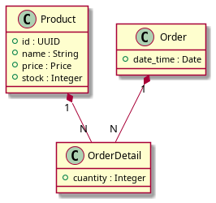
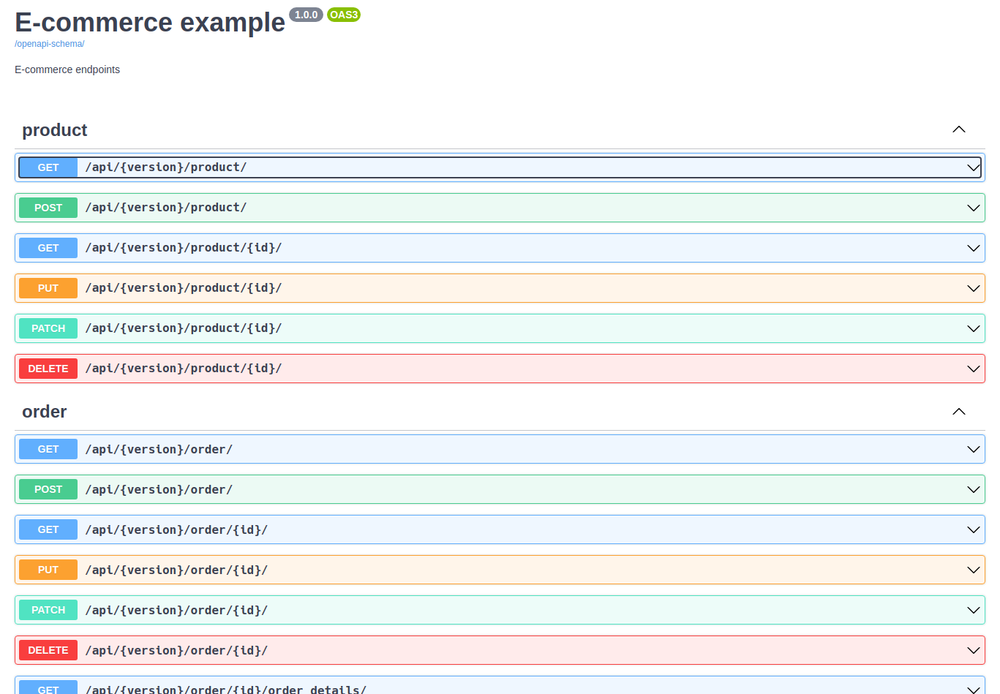
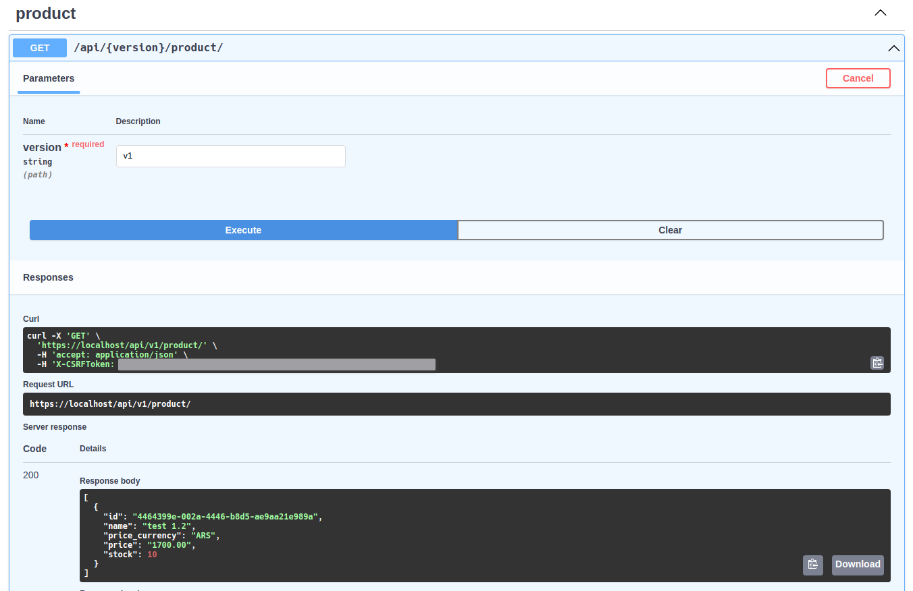

# Overview

Basic project about an e-commerce REST API:

**`Class diagram`**:



**`Components`**:

- REST API (backend):
    - [Django](https://www.djangoproject.com/) 4.0
    - [Django REST Framework](http://www.django-rest-framework.org/)
    - [Simple JWT](https://django-rest-framework-simplejwt.readthedocs.io/en/latest/)
    - [OpenAPI Schema](https://www.django-rest-framework.org/api-guide/schemas/#generating-an-openapi-schema)
- Database:
    - [PostgreSQL](https://www.postgresql.org/) 14.1
- Web Server:
    - [NGINX](https://www.nginx.com/) 1.21.4

# Table of contents

* [Get started](#get-started)
  * [Installation](#installation)
* [How to use this REST API](#how-to-use-this-rest-api)
* [Developers](#developers)
  * [Testing](#testing)
  * [Static code analysis tools](#static-code-analysis-tools)
    * [Find Problems](#find-problems)

# Get Started

## Installation

```bash
bash install.sh
```

# How to use this REST API

Here are some examples of how to use the Rest API: https://localhost/swagger-ui/
([jq](https://stedolan.github.io/jq/) is required)

## Set environment variables from .env file

```bash
export $(grep -v '^#' .env | xargs)
```

## Get authentication token:

```bash
JWT_TOKEN=$(
    curl -k -s -X POST \
        'https://localhost/api/token/' \
        -H 'Content-Type: application/json' \
        -d "{
            \"username\": \"${DJANGO_SUPERUSER_USERNAME}\",
            \"password\": \"${DJANGO_SUPERUSER_PASSWORD}\"
        }" \
    | jq -r '.access'
) && echo "JWT token: ${JWT_TOKEN}"
```

## Register a product

```bash
PRODUCT_ID=$(
    curl -k -s -X POST \
        'https://localhost/api/v1/product/' \
        -H 'Content-Type: application/json' \
        -H "Authorization: Bearer ${JWT_TOKEN}" \
        -d '{
            "name": "test 1.1",
            "price": "1200.99",
            "stock": 10
        }' \
    | jq -r '.id'
) && echo "product ID: ${PRODUCT_ID}"
```

## Edit a product

**PUT**
```bash
curl -k -s -X PUT \
    "https://localhost/api/v1/product/${PRODUCT_ID}/" \
    -H 'Content-Type: application/json' \
    -H "Authorization: Bearer ${JWT_TOKEN}" \
    -d '{
        "name": "test 1.2",
        "price": "1500",
        "stock": 10
    }' | jq
```

**PATCH**
```bash
curl -k -s -X PATCH \
    "https://localhost/api/v1/product/${PRODUCT_ID}/" \
    -H 'Content-Type: application/json' \
    -H "Authorization: Bearer ${JWT_TOKEN}" \
    -d '{
        "price": 1700
    }' | jq
```

## More cases

**`Swagger UI`**: https://localhost/swagger-ui/



product list:



# Developers

## Testing

run backend unit testing:

```bash
docker-compose exec backend python manage.py test
```

## Static code analysis tools

### Find Problems

Checkers statically analyzes the code to find problems.

```bash
# run shellcheck, pylint, prospector, black and isort
docker-compose exec backend bash code_checkers.sh
```

Tools used:
- [shellcheck](https://github.com/koalaman/shellcheck): ShellCheck is a GPLv3 tool that gives warnings and suggestions for bash/sh shell scripts.
- [pylint](https://github.com/PyCQA/pylint): Pylint is a Python static code analysis tool which looks for programming errors, helps enforcing a coding standard, sniffs for code smells and offers simple refactoring suggestions.
- [black](https://github.com/psf/black): Black is the uncompromising Python code formatter.
- [isort](https://pycqa.github.io/isort/): Python utility / library to sort imports alphabetically, and automatically separated into sections and by type.
- [prospector](https://github.com/PyCQA/prospector): Prospector is a tool to analyse Python code and output information about errors, potential problems, convention violations and complexity.

  Tools executed by Prospector:
  - [bandit](https://github.com/PyCQA/bandit): Bandit is a tool designed to find common security issues.
  - [dodgy](https://github.com/landscapeio/dodgy): It is a series of simple regular expressions designed to detect things such as accidental SCM diff checkins, or passwords or secret keys hard coded into files.
  - [mccabe](https://github.com/PyCQA/mccabe): Complexity checker.
  - [mypy](https://github.com/python/mypy): Mypy is an optional static type checker for Python.
  - [pep257](https://github.com/PyCQA/pydocstyle): pep257 is a static analysis tool for checking compliance with Python PEP 257.
  - [pep8](https://pep8.readthedocs.io/en/release-1.7.x/): pep8 is a tool to check your Python code against some of the style conventions in PEP 8.
  - [pyflakes](https://github.com/PyCQA/pyflakes): Pyflakes analyzes programs and detects various errors.
  - [pyroma](https://github.com/regebro/pyroma): Pyroma is a product aimed at giving a rating of how well a Python project complies with the best practices of the Python packaging ecosystem, primarily PyPI, pip, Distribute etc, as well as a list of issues that could be improved.
